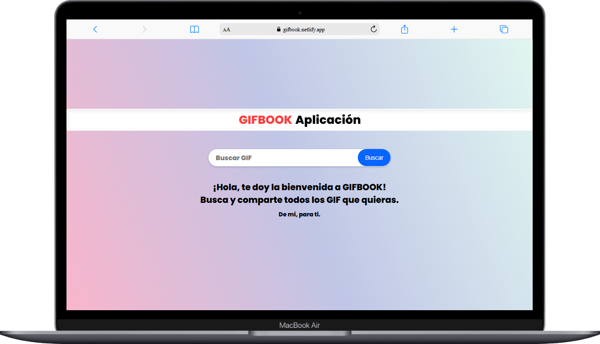
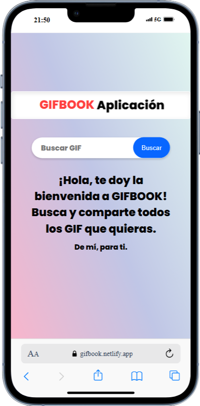

# Gifbook

**Gifbook** es una aplicación web desarrollada con **React + Vite** que permite buscar y compartir GIFs animados ilimitados usando la API de Giphy. Ideal para divertirte y descubrir contenido visual en segundos.

- 🔗 **Deploy en Netlify**: https://gifbook.netlify.app
- 📲 **Ver demo en YouTube**: https://www.youtube.com/watch?v=DMSPqtG46rA

---

## 🚀 Funcionalidades

- 🔍 Búsqueda de GIFs por palabras clave.
- ⚡️ Interfaz rápida y responsiva.
- 📲 Estilos modernos con CSS.
- 🔧 Consumiendo la API de Giphy.
- 🌟 Integración con WhatsApp, Facebook y Twitter para compartir GIFs.

---

## 🛠️ Tecnologías

- HTML5, CSS3, JavaScript
- [React](https://reactjs.org/)
- [Vite](https://vitejs.dev/)
- [Giphy API](https://developers.giphy.com/)

---

## 🖥️ Vista previa




## 📦 Instalación

Si quieres correrlo localmente necesitás una API key de [Giphy](https://developers.giphy.com/).

1. Creá un archivo llamado `.env` en la raíz del proyecto.
2. Pegá tu API key así:  `VITE_TENOR_API_KEY=tu_api_key_aqui`

```bash
git clone https://github.com/CarlosDanielOK/Gifbook.git
cd Gifbook
npm install
npm run dev
